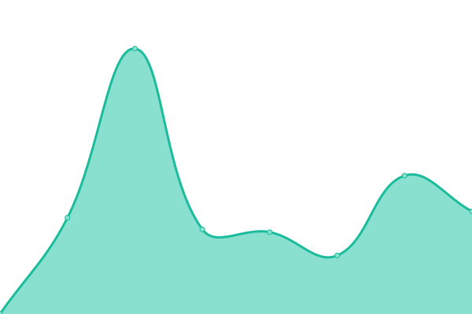

# [📈 Live Status](https://alexandervantrijffel.github.io/upptimemonitoring): <!--live status--> **🟩 All systems operational**

This repository contains the open-source uptime monitor and status page for [Alexander van Trijffel](https://structura.ws), powered by [Upptime](https://github.com/upptime/upptime).

With [Upptime](https://upptime.js.org), you can get your own unlimited and free uptime monitor and status page, powered entirely by a GitHub repository. We use [Issues](https://github.com/alexandervantrijffel/upptimemonitoring/issues) as incident reports, [Actions](https://github.com/alexandervantrijffel/upptimemonitoring/actions) as uptime monitors, and [Pages](https://alexandervantrijffel.github.io/upptimemonitoring) for the status page.

<!--start: status pages-->
<!-- This summary is generated by Upptime (https://github.com/upptime/upptime) -->
<!-- Do not edit this manually, your changes will be overwritten -->
<!-- prettier-ignore -->
| URL | Status | History | Response Time | Uptime |
| --- | ------ | ------- | ------------- | ------ |
|  [Structura](https://structura.ws) | 🟩 Up | [structura.yml](https://github.com/alexandervantrijffel/upptimemonitoring/commits/HEAD/history/structura.yml) | 

 156ms
     
 | 

<a href="https://alexandervantrijffel.github.io/upptimemonitoring/history/structura">100.00%</a>
    

|  [Last Noted Web](https://lastnoted.com) | 🟩 Up | [last-noted-web.yml](https://github.com/alexandervantrijffel/upptimemonitoring/commits/HEAD/history/last-noted-web.yml) | 

 261ms
     
 | 

<a href="https://alexandervantrijffel.github.io/upptimemonitoring/history/last-noted-web">100.00%</a>
    

|  [Last Noted Eventreporter](https://lastnoted.com/eventreporter) | 🟩 Up | [last-noted-eventreporter.yml](https://github.com/alexandervantrijffel/upptimemonitoring/commits/HEAD/history/last-noted-eventreporter.yml) | 

 490ms
     
 | 

<a href="https://alexandervantrijffel.github.io/upptimemonitoring/history/last-noted-eventreporter">100.00%</a>
    

|  [Last Noted Eventsink](https://lastnoted.com/eventsink) | 🟩 Up | [last-noted-eventsink.yml](https://github.com/alexandervantrijffel/upptimemonitoring/commits/HEAD/history/last-noted-eventsink.yml) | 

 487ms
     
 | 

<a href="https://alexandervantrijffel.github.io/upptimemonitoring/history/last-noted-eventsink">100.00%</a>
    

|  [Smith and Doe Web](https://www.smithanddoe.com) | 🟩 Up | [smith-and-doe-web.yml](https://github.com/alexandervantrijffel/upptimemonitoring/commits/HEAD/history/smith-and-doe-web.yml) | 

 824ms
     
 | 

<a href="https://alexandervantrijffel.github.io/upptimemonitoring/history/smith-and-doe-web">100.00%</a>
    

|  [Smith and Doe Privacy API](https://www.smithanddoe.com/privacy/API/QuickScanModel) | 🟩 Up | [smith-and-doe-privacy-api.yml](https://github.com/alexandervantrijffel/upptimemonitoring/commits/HEAD/history/smith-and-doe-privacy-api.yml) | 

 300ms
     
 | 

<a href="https://alexandervantrijffel.github.io/upptimemonitoring/history/smith-and-doe-privacy-api">100.00%</a>
    

|  [Craftify](https://craftify.nl) | 🟩 Up | [craftify.yml](https://github.com/alexandervantrijffel/upptimemonitoring/commits/HEAD/history/craftify.yml) | 

 539ms
     
 | 

<a href="https://alexandervantrijffel.github.io/upptimemonitoring/history/craftify">100.00%</a>
    

|  [ProSim Home](https://prosim-ar.com) | 🟩 Up | [pro-sim-home.yml](https://github.com/alexandervantrijffel/upptimemonitoring/commits/HEAD/history/pro-sim-home.yml) | 

 2477ms
     
 | 

<a href="https://alexandervantrijffel.github.io/upptimemonitoring/history/pro-sim-home">100.00%</a>
    

|  [ProSim Forum](https://forum.prosim-ar.com) | 🟩 Up | [pro-sim-forum.yml](https://github.com/alexandervantrijffel/upptimemonitoring/commits/HEAD/history/pro-sim-forum.yml) | 

 822ms
     
 | 

<a href="https://alexandervantrijffel.github.io/upptimemonitoring/history/pro-sim-forum">100.00%</a>
    

|  [ProSim Shop](https://shop.prosim-ar.com) | 🟩 Up | [pro-sim-shop.yml](https://github.com/alexandervantrijffel/upptimemonitoring/commits/HEAD/history/pro-sim-shop.yml) | 

 2819ms
     
 | 

<a href="https://alexandervantrijffel.github.io/upptimemonitoring/history/pro-sim-shop">100.00%</a>
    

|  [ProSim Downloads](https://cdndl.prosim-ar.com/ProSimB738) | 🟩 Up | [pro-sim-downloads.yml](https://github.com/alexandervantrijffel/upptimemonitoring/commits/HEAD/history/pro-sim-downloads.yml) | 

 928ms
     
 | 

<a href="https://alexandervantrijffel.github.io/upptimemonitoring/history/pro-sim-downloads">100.00%</a>
    

|  ProSim lic API#1 | 🟩 Up | [pro-sim-lic-api-1.yml](https://github.com/alexandervantrijffel/upptimemonitoring/commits/HEAD/history/pro-sim-lic-api-1.yml) | 

 371ms
     
 | 

<a href="https://alexandervantrijffel.github.io/upptimemonitoring/history/pro-sim-lic-api-1">100.00%</a>
    

|  [Deloitte Process X-Ray](https://processxray.deloitte.com/x/process-x-ray) | 🟩 Up | [deloitte-process-x-ray.yml](https://github.com/alexandervantrijffel/upptimemonitoring/commits/HEAD/history/deloitte-process-x-ray.yml) | 

 856ms
     
 | 

<a href="https://alexandervantrijffel.github.io/upptimemonitoring/history/deloitte-process-x-ray">100.00%</a>
    

|  [TOP Onions](https://www.toponions.com) | 🟩 Up | [top-onions.yml](https://github.com/alexandervantrijffel/upptimemonitoring/commits/HEAD/history/top-onions.yml) | 

 918ms
     
 | 

<a href="https://alexandervantrijffel.github.io/upptimemonitoring/history/top-onions">100.00%</a>
    

|  [TOP Taste](https://www.top-taste.com) | 🟩 Up | [top-taste.yml](https://github.com/alexandervantrijffel/upptimemonitoring/commits/HEAD/history/top-taste.yml) | 

 1099ms
     
 | 

<a href="https://alexandervantrijffel.github.io/upptimemonitoring/history/top-taste">100.00%</a>
    

|  [Lion Foods](https://lionfoods.nl) | 🟩 Up | [lion-foods.yml](https://github.com/alexandervantrijffel/upptimemonitoring/commits/HEAD/history/lion-foods.yml) | 

 2402ms
     
 | 

<a href="https://alexandervantrijffel.github.io/upptimemonitoring/history/lion-foods">100.00%</a>
    

|  [Lawline](https://lawline.se) | 🟩 Up | [lawline.yml](https://github.com/alexandervantrijffel/upptimemonitoring/commits/HEAD/history/lawline.yml) | 

 751ms
     
 | 

<a href="https://alexandervantrijffel.github.io/upptimemonitoring/history/lawline">100.00%</a>
    

<!--end: status pages-->

[**Visit our status website →**](https://alexandervantrijffel.github.io/upptimemonitoring)

## 📄 License

- Powered by: [Upptime](https://github.com/upptime/upptime)
- Code: [MIT](./LICENSE) © [Alexander van Trijffel](https://structura.ws)
- Data in the `./history` directory: [Open Database License](https://opendatacommons.org/licenses/odbl/1-0/)
