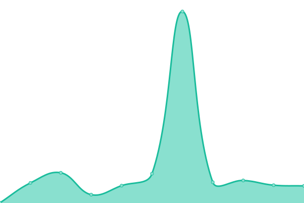
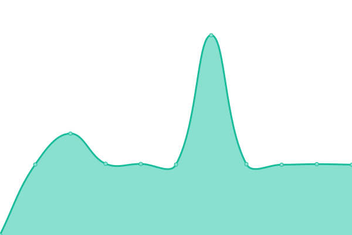
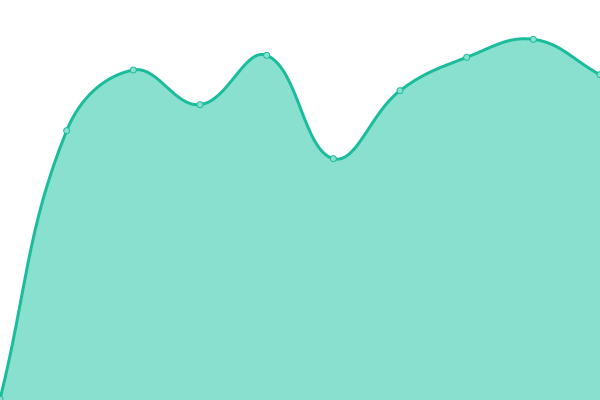
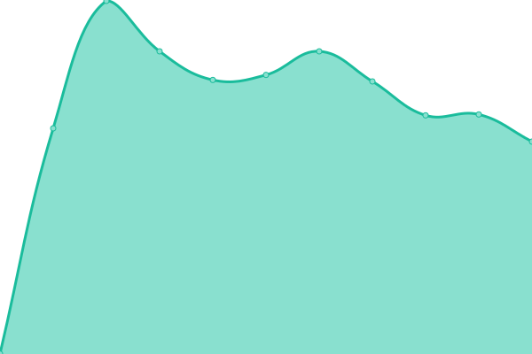
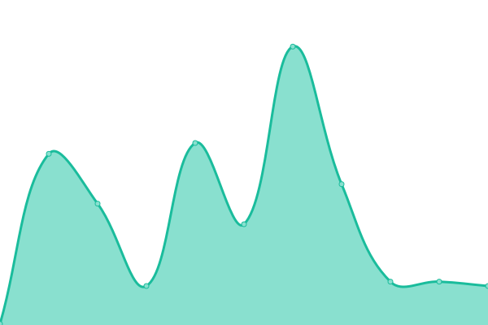

# [📈 Live Status](https://structura.ws): <!--live status--> **🟧 Partial outage**

This repository contains the open-source uptime monitor and status page for [Alexander van Trijffel](https://structura.ws), powered by [Upptime](https://github.com/upptime/upptime).

With [Upptime](https://upptime.js.org), you can get your own unlimited and free uptime monitor and status page, powered entirely by a GitHub repository. We use [Issues](https://github.com/alexandervantrijffel/upptimemonitoring/issues) as incident reports, [Actions](https://github.com/alexandervantrijffel/upptimemonitoring/actions) as uptime monitors, and [Pages](https://structura.ws) for the status page.

<!--start: status pages-->
<!-- This summary is generated by Upptime (https://github.com/upptime/upptime) -->
<!-- Do not edit this manually, your changes will be overwritten -->

| URL                                                                                 | Status  | History                                                                                                                                         | Response Time                                                                                  | Uptime                                                                                                                                                                                                                                                                                           |
| ----------------------------------------------------------------------------------- | ------- | ----------------------------------------------------------------------------------------------------------------------------------------------- | ---------------------------------------------------------------------------------------------- | ------------------------------------------------------------------------------------------------------------------------------------------------------------------------------------------------------------------------------------------------------------------------------------------------ |
| [Structura](https://structura.ws)                                                   | 🟩 Up   | [structura.yml](https://github.com/alexandervantrijffel/upptimemonitoring/commits/master/history/structura.yml)                                 |  226ms                 |                                  |
| [Last Noted Web](https://lastnoted.com)                                             | 🟩 Up   | [last-noted-web.yml](https://github.com/alexandervantrijffel/upptimemonitoring/commits/master/history/last-noted-web.yml)                       |  212ms            |                        |
| [Last Noted Eventreporter](https://lastnoted.com/eventreporter)                     | 🟩 Up   | [last-noted-eventreporter.yml](https://github.com/alexandervantrijffel/upptimemonitoring/commits/master/history/last-noted-eventreporter.yml)   |  488ms  |    |
| [Last Noted Eventsink](https://lastnoted.com/eventsink)                             | 🟩 Up   | [last-noted-eventsink.yml](https://github.com/alexandervantrijffel/upptimemonitoring/commits/master/history/last-noted-eventsink.yml)           |  488ms      |            |
| [Smith and Doe Web](https://www.smithanddoe.com)                                    | 🟩 Up   | [smith-and-doe-web.yml](https://github.com/alexandervantrijffel/upptimemonitoring/commits/master/history/smith-and-doe-web.yml)                 |  1043ms        |                  |
| [Smith and Doe Privacy API](https://www.smithanddoe.com/privacy/API/QuickScanModel) | 🟩 Up   | [smith-and-doe-privacy-api.yml](https://github.com/alexandervantrijffel/upptimemonitoring/commits/master/history/smith-and-doe-privacy-api.yml) |  297ms |  |
| [Craftify](https://craftify.nl)                                                     | 🟩 Up   | [craftify.yml](https://github.com/alexandervantrijffel/upptimemonitoring/commits/master/history/craftify.yml)                                   |  438ms                  |                                     |
| [ProSim Home](https://prosim-ar.com)                                                | 🟩 Up   | [pro-sim-home.yml](https://github.com/alexandervantrijffel/upptimemonitoring/commits/master/history/pro-sim-home.yml)                           |  946ms              |                            |
| [ProSim Forum](https://forum.prosim-ar.com)                                         | 🟩 Up   | [pro-sim-forum.yml](https://github.com/alexandervantrijffel/upptimemonitoring/commits/master/history/pro-sim-forum.yml)                         |  980ms             |                          |
| [ProSim Shop](https://shop.prosim-ar.com)                                           | 🟩 Up   | [pro-sim-shop.yml](https://github.com/alexandervantrijffel/upptimemonitoring/commits/master/history/pro-sim-shop.yml)                           |  899ms              |                            |
| [ProSim Downloads](https://cdndl.prosim-ar.com/ProSimB738)                          | 🟩 Up   | [pro-sim-downloads.yml](https://github.com/alexandervantrijffel/upptimemonitoring/commits/master/history/pro-sim-downloads.yml)                 |  147ms         |                  |
| ProSim lic API#1                                                                    | 🟥 Down | [pro-sim-lic-api-1.yml](https://github.com/alexandervantrijffel/upptimemonitoring/commits/master/history/pro-sim-lic-api-1.yml)                 |  0ms           |                   |
| [Deloitte Process X-Ray](https://processxray.deloitte.com/x/process-x-ray)          | 🟩 Up   | [deloitte-process-x-ray.yml](https://github.com/alexandervantrijffel/upptimemonitoring/commits/master/history/deloitte-process-x-ray.yml)       |  231ms    |        |
| [TOP Onions](https://www.toponions.com)                                             | 🟩 Up   | [top-onions.yml](https://github.com/alexandervantrijffel/upptimemonitoring/commits/master/history/top-onions.yml)                               |  878ms                |                                 |
| [TOP Taste](https://www.top-taste.com)                                              | 🟩 Up   | [top-taste.yml](https://github.com/alexandervantrijffel/upptimemonitoring/commits/master/history/top-taste.yml)                                 |  1028ms                |                                   |
| [Lion Foods](https://lionfoods.nl)                                                  | 🟩 Up   | [lion-foods.yml](https://github.com/alexandervantrijffel/upptimemonitoring/commits/master/history/lion-foods.yml)                               |  1811ms               |                                |

<!--end: status pages-->

[**Visit our status website →**](https://structura.ws)

## 📄 License

- Code: [MIT](./LICENSE) © [Alexander van Trijffel](https://structura.ws)
- Data in the `./history` directory: [Open Database License](https://opendatacommons.org/licenses/odbl/1-0/)
